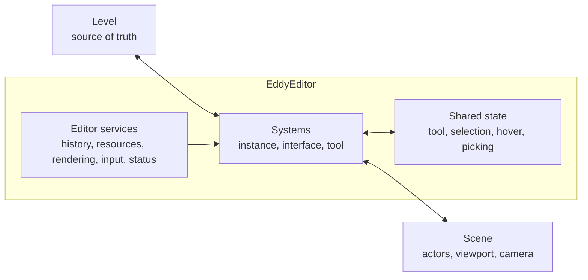
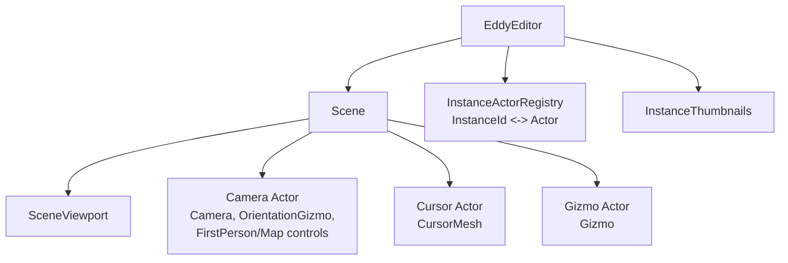
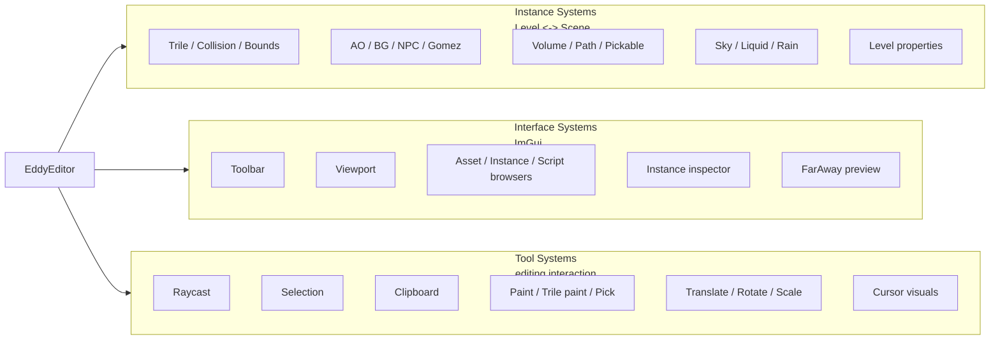
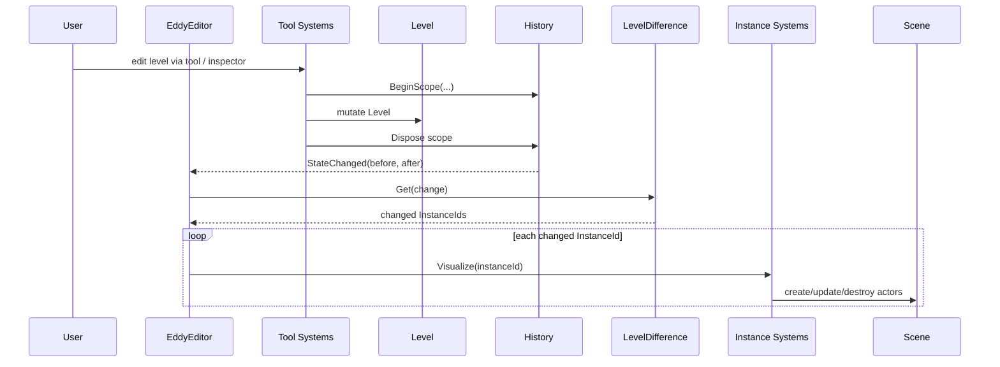
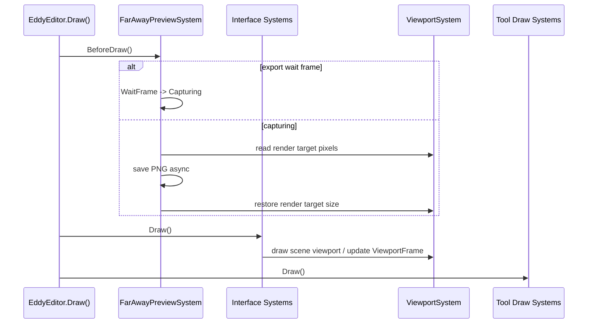

# EddyEditor Architecture

## Overview

```mermaid
flowchart LR
    Level["Level<br/>source of truth"]

    subgraph Eddy["EddyEditor"]
        State["Shared state<br/>tool, selection, hover, picking"]
        Services["Editor services<br/>history, resources, rendering, input, status"]
        Systems["Systems<br/>instance, interface, tool"]
    end

    Scene["Scene<br/>actors, viewport, camera"]

    Level <--> Systems
    Systems <--> State
    Systems <--> Scene
    Services --> Systems
```

## Scene Composition

```mermaid
flowchart TD
    EddyEditor["EddyEditor"]
    Scene["Scene"]
    Viewport["SceneViewport"]
    Registry["InstanceActorRegistry<br/>InstanceId <-> Actor"]
    Thumbnails["InstanceThumbnails"]
    Camera["Camera Actor<br/>Camera, OrientationGizmo,<br/>FirstPerson/Map controls"]
    Cursor["Cursor Actor<br/>CursorMesh"]
    Gizmo["Gizmo Actor<br/>Gizmo"]

    EddyEditor --> Scene
    EddyEditor --> Registry
    EddyEditor --> Thumbnails
    Scene --> Viewport
    Scene --> Camera
    Scene --> Cursor
    Scene --> Gizmo
```

## System Groups

```mermaid
flowchart LR
    EddyEditor["EddyEditor"]

    subgraph InstanceSystems["Instance Systems<br/>Level <-> Scene"]
        Triles["Trile / Collision / Bounds"]
        Instances["AO / BG / NPC / Gomez"]
        Shapes["Volume / Path / Pickable"]
        Environment["Sky / Liquid / Rain"]
        LevelProps["Level properties"]
    end

    subgraph InterfaceSystems["Interface Systems<br/>ImGui"]
        Toolbar["Toolbar"]
        Viewport["Viewport"]
        Browsers["Asset / Instance / Script browsers"]
        Inspector["Instance inspector"]
        Preview["FarAway preview"]
    end

    subgraph ToolSystems["Tool Systems<br/>editing interaction"]
        Raycast["Raycast"]
        Selection["Selection"]
        Clipboard["Clipboard"]
        Paint["Paint / Trile paint / Pick"]
        Transform["Translate / Rotate / Scale"]
        Cursor["Cursor visuals"]
    end

    EddyEditor --> InstanceSystems
    EddyEditor --> InterfaceSystems
    EddyEditor --> ToolSystems
```

```mermaid
sequenceDiagram
    participant User
    participant Eddy as EddyEditor
    participant Tools as Tool Systems
    participant Level
    participant History
    participant Diff as LevelDifference
    participant Instances as Instance Systems
    participant Scene

    User->>Tools: edit level via tool / inspector
    Tools->>History: BeginScope(...)
    Tools->>Level: mutate Level
    Tools->>History: Dispose scope
    History-->>Eddy: StateChanged(before, after)
    Eddy->>Diff: Get(change)
    Diff-->>Eddy: changed InstanceIds
    loop each changed InstanceId
        Eddy->>Instances: Visualize(instanceId)
        Instances->>Scene: create/update/destroy actors
    end
```

```mermaid
sequenceDiagram
    participant Eddy as EddyEditor.Draw()
    participant Faraway as FarAwayPreviewSystem
    participant UI as Interface Systems
    participant Viewport as ViewportSystem
    participant Tools as Tool Draw Systems

    Eddy->>Faraway: BeforeDraw()
    alt export wait frame
        Faraway->>Faraway: WaitFrame -> Capturing
    else capturing
        Faraway->>Viewport: read render target pixels
        Faraway->>Faraway: save PNG async
        Faraway->>Viewport: restore render target size
    end

    Eddy->>UI: Draw()
    UI->>Viewport: draw scene viewport / update ViewportFrame
    Eddy->>Tools: Draw()
```
