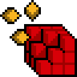
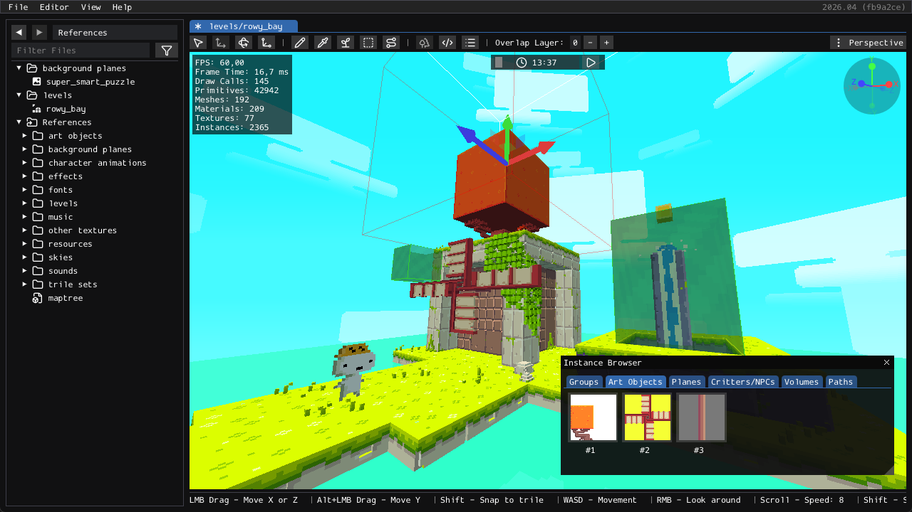

#  FEZEditor

## A Modding Tool for FEZ game



*A custom **Rowy Bay** level opened in the **Eddy** level editor.*

## Overview

FEZEditor is a cross-platform GUI tool for exploring, managing, and modding FEZ game assets.

It can open original game PAK files, extracted asset directories, and mod projects.

The editor provides specialized tools for viewing and editing levels, art objects, trile sets, world maps, skies,
localization, save files, and other game resources.

It also supports extracting assets and exporting levels as GLTF dioramas.

## User Guide

Will be available at [FEZModding Wiki](https://fezmodding.github.io/wiki/editor) soon.

## Cloning

Clone the repository and its submodules:

```bash
git clone --recurse-submodules <repository-url>
```

If you have already cloned the repository:

```bash
git submodule update --init --recursive
```

## Building

### Prerequisites

- [.NET 10.0 SDK](https://dotnet.microsoft.com/download/dotnet/10.0) is required for `Debug` builds.

> [!NOTE]
> `Release` builds are self-contained and do not require the .NET SDK to be installed on the target machine.

> [!NOTE]
> The `fxc` shader compiler is now included in this repository.
>
> On Linux / macOS, make sure Wine is installed!

### Build and run locally

```bash
dotnet build -c Debug
```

### Build a self-contained release binary

```bash
dotnet publish -c Release -r win-x64    # Windows
dotnet publish -c Release -r linux-x64  # Linux
dotnet publish -c Release -r osx-arm64  # macOS
```

> [!NOTE]
> In JetBrains Rider, ReSharper Build must be disabled to ensure assets are always up to date on every project build.
> Go to `Settings > Build, Execution, Deployment > Toolset and Build` and uncheck `Use ReSharper Build`.

### Content Packaging

- **Debug**: assets are copied to `Content/` next to the executable.
- **Release**: assets are bundled inside the executable.

## Features

### Asset Management

* Opening PAK files (readonly mode)
* Opening folders with extracted assets (XNB and FEZRepacker formats are supported)
* Extracting assets from PAK

### Asset Editing / Viewing

* `EddyEditor`: Levels
* `ChrisEditor`: Art Objects and Trile Sets
* `JadeEditor`: World Map
* `LukeEditor`: Sky definitions
* `DiezEditor`: Tracked Songs
* `MuEditor`: NPC Metadata
* `PoEditor`: Static text (localization files)
* `SallyEditor`: Save files (PC format only)
* `ZuEditor`: SpriteFonts
* `RickViewer`: Sound effects
* `PhilExporter`: Exporting levels as GLTF dioramas

## Documentation

Refer to [FEZModding Wiki](https://fezmodding.github.io/wiki/game/) for FEZ assets specifications (incomplete).

## Contributing

**Contributions are welcome!**
Whether it's bug fixes, implementation improvements or suggestions, your help will be greatly appreciated.

## Credits

This project uses:

* [FNA](https://github.com/FNA-XNA/FNA) as main app framework.
* [FEZRepacker](https://github.com/FEZModding/FEZRepacker) for taking on the heavy lifting of reading and converting assets.
* [ImGui.NET](https://github.com/ImGuiNET/ImGui.NET) for creating complex editor UI.

## Special thanks to

* [FEZModding folks](https://github.com/FEZModding) for providing modding materials and tools.
* [Godot contributors](https://github.com/godotengine/godot) for saving hours of headaches when creating a PoC.
* [Krzyhau](https://github.com/Krzyhau) for his contributions and splash screen art work!
* [Michael Romero](https://github.com/halogenica) for his insperational [FezViewer](https://halogenica.net/tools/fez-viewer/) tool.